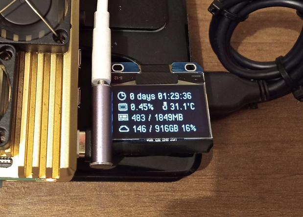

# oled status screen for sh1106 drivers




This is the script that outputs system status on a sh1106 (**not ssd1306**) OLED. It's tailored to my needs so you will probably want to modify it a little bit.

## Setup

1. Enable i2c interface on your raspberry pi.
2. Check that your oled is connected using `i2cdetect -y 1`. The correct output is:

```s
     0  1  2  3  4  5  6  7  8  9  a  b  c  d  e  f
00:                         -- -- -- -- -- -- -- --
10: -- -- -- -- -- -- -- -- -- -- -- -- -- -- -- --
20: -- -- -- -- -- -- -- -- -- -- -- -- -- -- -- --
30: -- -- -- -- -- -- -- -- -- -- -- -- 3c -- -- --
40: -- -- -- -- -- -- -- -- -- -- -- -- -- -- -- --
50: -- -- -- -- -- -- -- -- -- -- -- -- -- -- -- --
60: -- -- -- -- -- -- -- -- -- -- -- -- -- -- -- --
70: -- -- -- -- -- -- -- --
```

3. Follow this guide to install luma.oled. Make sure puthon3 is installed.
   [https://luma-oled.readthedocs.io/en/latest/software.html](https://luma-oled.readthedocs.io/en/latest/software.html)

## Running manually

In the repo folder, run:
`python3 status.py`

## Running as a service on startup

1. Create a new service file:
   `sudo nano /etc/systemd/system/oled.service`
2. Paste this into it:

```ini
[Unit]
Description = SH1106 status OLED.
After = network.target

[Service]
WorkingDirectory=/full/path/to/repo/oled_sh1106_status
ExecStart = python3 status.py

[Install]
WantedBy = multi-user.target
```

3. `sudo systemctl daemon-reload`
4. `sudo systemctl enable oled.service`
5. `sudo systemctl start oled.service`

If you make any changes to the service file, run:

```bash
sudo systemctl daemon-reload
sudo systemctl stop oled.service
```

If you want to stop the service:

```bash
sudo systemctl stop oled.service
```

## Status display

You can send custom status messages from anywhere in the os. You can add a new message by running

```bash
python3 up.py add Your Message
```

After that, it will be displayed on the oled. To remove it, run

```bash
python3 up.py remove Your Message
```

You can use this feature to track background tasks. For example:

```bash
python3 /full/path/to/repo/oled_sh1106_status add Backup Job ; your_backup_command ; python3 /full/path/to/repo/oled_sh1106_status remove Backup Job
```

To make it shorter, you can create a symlink:

```bash
sudo ln -sf ~/feats/oled_sh1106_status/up.py /srv/oled/up.py
```
